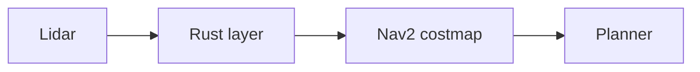

Inline maths $x_k = A x_{k-1} + w_k$ and display:

$$ c(d) = 252\, e^{-\alpha (d - r)} $$

## A diagram


```mermaid
graph LR; sensor[Lidar] --> layer[Rust layer] --> costmap[Nav2 costmap] --> planner[Planner]
```

### Some code

```rust
fn main() { println!("hello"); }
```
